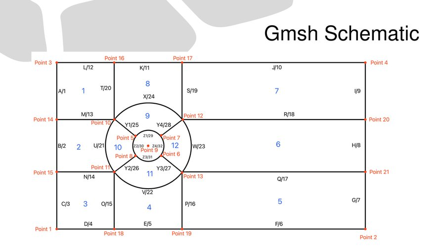

# Laminar Mesh Report — Flow over a Circular Cylinder (D = 0.25 m)

## 1. Scope and Objectives
This report documents the **laminar-case mesh** used for 2D flow over a circular cylinder of diameter $D=0.25\,\mathrm{m}$. The goals are:
- to define a mesh that **resolves near-wall gradients and the near wake** at low Reynolds numbers with **controlled cost**;
- to verify **shape-quality metrics** (SICN, SIGE, aspect ratio, non-orthogonality, skewness) for solver stability and accuracy;
- to provide a **reproducible Gmsh/OpenFOAM pipeline** suitable for a personal workstation.

---

## 2. Problem Definition

- **Geometry:** 2D crossflow over a cylinder of diameter $D=0.25\,\mathrm{m}$.
- **Domain:** $6\,\mathrm{m}\times 3\,\mathrm{m}$ in the x–y plane, extruded by $0.05\,\mathrm{m}$ in $z$ to realize a 2D case in OpenFOAM.
- **Flow regime:** Laminar (targeted $\mathrm{Re}\le 500$).
- **Reference case:** $\mathrm{Re}=100$, $U_\infty=0.00604\,\mathrm{m/s}$, $\nu=1.51\times 10^{-5}\,\mathrm{m^2/s}$.

### 2.1 Boundary Conditions
| Patch Name | Type     | Description                          |
|------------|----------|--------------------------------------|
| Inlet      | patch    | Uniform velocity $U_\infty$          |
| Outlet     | patch    | Zero-gradient pressure               |
| Cylinder   | wall     | No-slip                              |
| Top        | symmetry | Symmetry plane                       |
| Btm        | symmetry | Symmetry plane                       |
| FrtBck     | empty    | 2D (empty) in the spanwise direction |

---

## 3. Mesh Generation (Gmsh)

**Topology:** fully hexahedral (structured blocks).  
**Refinement strategy:** (i) near-wall band around the cylinder; (ii) near-wake and shear layers; (iii) moderate coarsening toward far field to control cell count.

> *Rationale.* At low $\mathrm{Re}$, the separation bubble and the first few diameters of the wake dominate accuracy demands; uniform over‑refinement is wasteful. The chosen distribution resolves these features while keeping the count feasible on a CPU‑only laptop.

### 3.1 Domain & Patch Layout
{ width=80% }

\newpage

### 3.2 Mesh Overview and Counts
{ width=80% }

| Metric                  | Value                  |
|-------------------------|------------------------|
| Total Cells             | 49,342                 |
| Cell Type               | Hexahedra only         |
| Total Points            | 99,728                 |
| Total Faces             | 197,890                |
| Internal Faces          | 98,162                 |
| Avg Faces per Cell      | 6                      |
| Cell Zones              | 1                      |
| Boundary Patches        | 6 (see §2.1)           |
| Spanwise Thickness (Z)  | 0.05 m (2D extrusion)  |

---

## 4. Mesh Quality Assessment

Quality was evaluated in Gmsh using shape‑based metrics. Values indicate **valid, well‑conditioned elements**:

- **SICN** (Signed Inverse Condition Number):  
  avg **0.6467**, min **0.1023**, max **0.7462**  
  → conditioning: **moderate–good**; no invalid/tangled elements.

- **SIGE** (Signed Inverse Gradient Error):  
  avg **0.9879**, min **0.7178**, max **1.0**  
  → gradient reconstruction: **excellent** (low numerical diffusion).

- **Aspect Ratio (max):** **3.99**  
- **Non‑Orthogonality (max/avg):** **43.93° / 8.77°**  
- **Skewness (max):** **0.46**

These are well within typical OpenFOAM tolerances; heavy non‑orthogonal correction is not expected to be necessary for the laminar regime.

\newpage

### 4.1 Quality Distributions
{ width=80% }

\newpage

{ width=80% }

---

## 5. Suitability for Laminar Simulations

- **Boundary Layer & Near Wake:** The refinement band around the cylinder and the first several diameters downstream supports accurate prediction of separation and the onset of a laminar vortex street (e.g. at $\mathrm{Re}\approx 100$).
- **Stability:** SICN/SIGE and low skewness imply robust linear solves with PISO in `icoFoam`.
- **Efficiency:** Concentrated refinement avoids unnecessary cost in the far field, enabling transient runs on modest hardware.

*Note.* Turbulent cases will require a **different mesh** (e.g. smaller first‑cell height for $y^+$ targeting, extended wake refinement). This laminar mesh is **not** intended for high‑Re turbulence modeling.

---

## 6. Reproducibility

- **Geometry & Mesh:** `cylinder_Laminar.geo` (Gmsh)
- **Post‑processing:** ParaView; additional analysis via Python/Gnuplot
- **Solver (example):** `icoFoam` (transient, incompressible, laminar; PISO)

To regenerate the mesh, open `cylinder_Laminar.geo` in Gmsh, set the desired element size fields if needed, generate 2D, extrude to $z=0.05\,\mathrm{m}$ for OpenFOAM (2D via `empty`), and export.

---

## 7. Conclusion

The laminar mesh satisfies geometric and numerical quality criteria for low‑Re cylinder flows. It is **sufficiently orthogonal**, **low‑skew**, and **targeted in refinement** for accurate resolution of near‑wall and near‑wake features at acceptable computational cost on a personal workstation.
