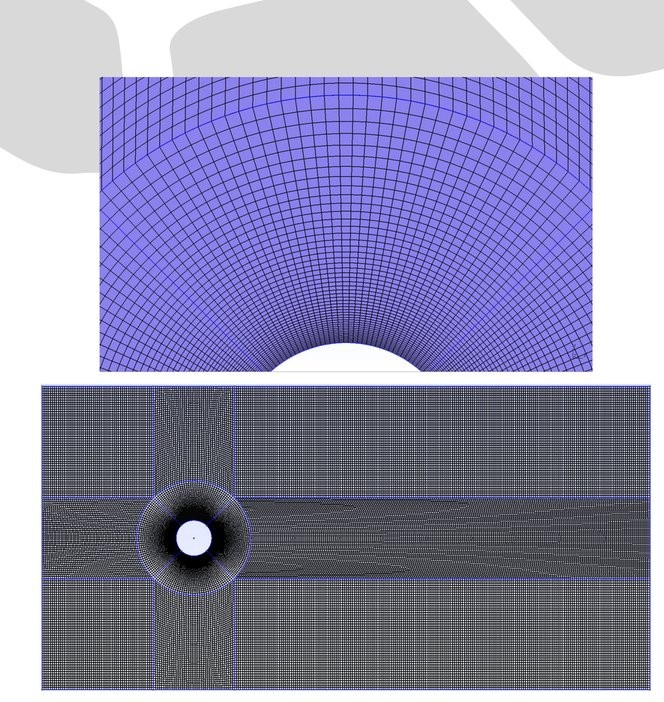
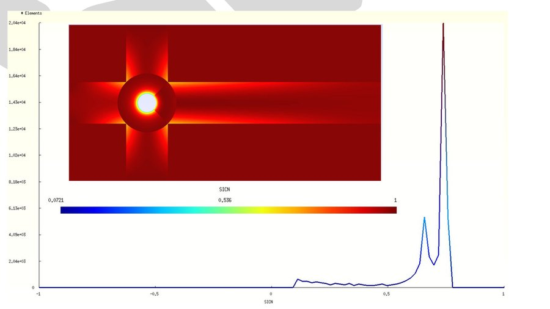
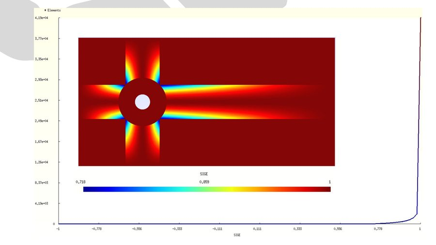

# Laminar Mesh Report — Flow over a Circular Cylinder

## 1. Introduction

This document presents the mesh configuration and quality assessment for the **laminar flow simulations** of the benchmark problem “Flow over a Circular Cylinder” with diameter \( D = 0.25 \, \text{m} \).  
The objective is to provide a mesh suitable for **low-Reynolds-number** computations, ensuring adequate resolution of near-wall regions and the wake, while maintaining computational feasibility on a personal workstation.

The laminar mesh is designed and generated in **Gmsh**, exported in OpenFOAM-compatible format, and validated for geometric integrity and quality metrics.

---

## 2. Problem Definition

- **Geometry:** 2D crossflow over a circular cylinder of diameter \( D = 0.25 \, \text{m} \).  
- **Domain size:** \( 6 \, \text{m} \times 3 \, \text{m} \) in \( x \)–\( y \) plane, extruded by \( 0.05 \, \text{m} \) in \( z \) to represent a 2D case in OpenFOAM.  
- **Flow regime:** Laminar (targeted Reynolds number range: \( \text{Re} \leq 500 \)).  
- **Case example:** \( \text{Re} = 100 \), \( U_\infty = 0.00604 \, \text{m/s} \), \( \nu = 1.51\times 10^{-5} \, \text{m}^2/\text{s} \).

### 2.1 Boundary Conditions

| Patch Name | Type      | Description                              |
|------------|-----------|------------------------------------------|
| Inlet      | patch     | Uniform velocity \( U_\infinity \)           |
| Outlet     | patch     | Zero-gradient pressure                   |
| Cylinder   | wall      | No-slip boundary condition               |
| Top        | symmetry  | Symmetry plane to reduce domain size     |
| Btm        | symmetry  | Symmetry plane to reduce domain size     |
| FrtBck     | empty     | 2D case definition in \( z \)-direction  |

---

## 3. Mesh Generation

### 3.1 Gmsh Setup
The geometry and mesh were created in **Gmsh** using a structured block topology with full hexahedral discretization.  
Refinement is concentrated in:
- The immediate vicinity of the cylinder (to resolve boundary layers)
- The near wake region (to capture vortex formation and shedding)
- The shear layers above and below the wake

### 3.2 Mesh Metrics

| Metric                | Value                  |
|-----------------------|------------------------|
| Total Cells           | 49,342                 |
| Cell Type             | Hexahedra only         |
| Total Points          | 99,728                 |
| Total Faces           | 197,890                |
| Internal Faces        | 98,162                 |
| Average Faces per Cell| 6                      |
| Cell Zones            | 1                      |
| Domain Thickness (Z)  | 0.05 m (2D extrusion)  |
| Boundary Patches      | 6 (as listed above)    |

---

## 4. Mesh Quality Assessment

Mesh quality was evaluated in Gmsh using **shape-based metrics**:

- **SICN** (Signed Inverse Condition Number):  
  - Average: 0.6467  
  - Min: 0.1023  
  - Max: 0.7462  
  - Interpretation: All elements valid; conditioning is moderate-to-good for solver stability.

- **SIGE** (Signed Inverse Gradient Error):  
  - Average: 0.9879  
  - Min: 0.7178  
  - Max: 1.0  
  - Interpretation: Excellent gradient reconstruction quality; minimal numerical diffusion expected.

- **Max Aspect Ratio:** 3.99 — within acceptable range for CFD solvers.  
- **Max Non-Orthogonality:** \( 43.93^\circ \) (average: \( 8.77^\circ \)) — no severe skewness.  
- **Max Skewness:** 0.46 — well below the critical threshold of 4 for OpenFOAM.  

These results confirm that the mesh is sufficiently orthogonal and well-shaped for accurate laminar simulations without requiring heavy non-orthogonal corrections.

---

## 5. Figures

### 5.1 Domain and Patch Layout

### 5.2 Mesh View

### 5.3 Mesh Quality — SICN

### 5.4 Mesh Quality — SIGE

---

## 6. Suitability for Laminar Flow Simulations

The chosen mesh resolution ensures:
- Accurate capture of boundary layer development at low Reynolds numbers without unnecessary refinement that would increase computational cost.
- Sufficient resolution in the wake to resolve early stages of the **laminar vortex street** at \( \text{Re} \approx 100 \).
- Stable convergence in OpenFOAM’s `icoFoam` solver with standard PISO settings.

For turbulent cases, a different mesh will be employed with:
- Higher near-wall refinement to meet \( y^+ \) requirements for turbulence models
- Larger wake refinement region to capture high-frequency turbulent structures.

---

## 7. Conclusion

The laminar mesh for the 2D flow over a circular cylinder satisfies all geometric and numerical quality criteria for low-Reynolds-number CFD simulations. Its structured, fully hexahedral topology ensures high solution accuracy while keeping computational cost feasible for a personal workstation.

