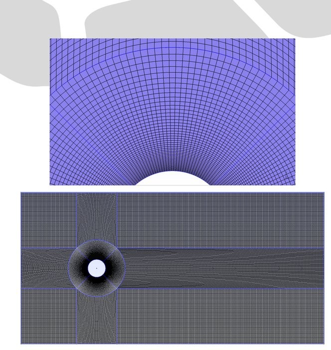
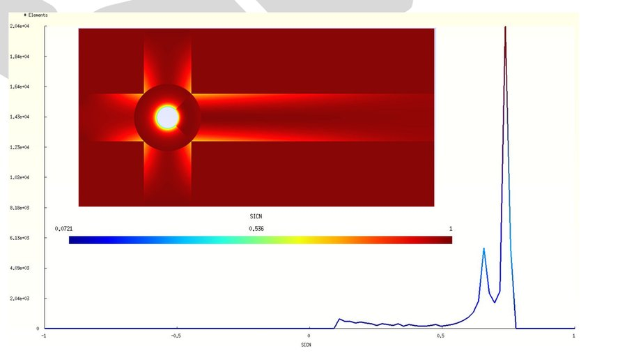

# Laminar Mesh Report — Flow over a Circular Cylinder (D = 0.25 m)

## 1. Scope and Objectives
This report documents the **laminar-case mesh** used for 2D flow over a circular cylinder of diameter $D=0.25\,\mathrm{m}$.  
Goals:
- Resolve near-wall gradients and the near wake at low Reynolds numbers with controlled computational cost.
- Verify mesh quality metrics (SICN, SIGE, aspect ratio, non-orthogonality, skewness) for solver stability and accuracy.
- Provide a reproducible Gmsh/OpenFOAM workflow suitable for a personal workstation.

---

## 2. Problem Definition

- **Geometry:** 2D crossflow over a cylinder of diameter $D=0.25\,\mathrm{m}$.
- **Domain:** $6\,\mathrm{m} \times 3\,\mathrm{m}$ in the $x$–$y$ plane, extruded by $0.05\,\mathrm{m}$ in $z$ for 2D in OpenFOAM.
- **Flow regime:** Laminar ($\mathrm{Re} \le 500$).
- **Reference case:** $\mathrm{Re} = 100$, $U_\infty = 0.00604\,\mathrm{m/s}$, $\nu = 1.51\times 10^{-5}\,\mathrm{m^2/s}$.

### 2.1 Boundary Conditions

| Patch Name | Type     | Description                          |
|------------|----------|--------------------------------------|
| Inlet      | patch    | Uniform velocity $U_\infty$          |
| Outlet     | patch    | Zero-gradient pressure               |
| Cylinder   | wall     | No-slip                              |
| Top        | symmetry | Symmetry plane                       |
| Btm        | symmetry | Symmetry plane                       |
| FrtBck     | empty    | 2D (empty) in the spanwise direction |

---

## 3. Mesh Generation (Gmsh)

**Topology:** Fully hexahedral (structured blocks).  
**Refinement strategy:** near-cylinder boundary layer, wake region, and shear layers; coarsening toward far field.

### 3.1 Domain & Patch Layout
{ width=80% }

\newpage

### 3.2 Mesh Overview
{ width=80% }

| Metric                  | Value                  |
|-------------------------|------------------------|
| Total Cells             | 49,342                 |
| Cell Type               | Hexahedra only         |
| Total Points            | 99,728                 |
| Total Faces             | 197,890                |
| Internal Faces          | 98,162                 |
| Avg Faces per Cell      | 6                      |
| Cell Zones              | 1                      |
| Boundary Patches        | 6 (see §2.1)           |
| Spanwise Thickness (Z)  | 0.05 m (2D extrusion)  |

\newpage

## 4. Mesh Quality

- **SICN:** avg 0.6467, min 0.1023, max 0.7462 → moderate–good.
- **SIGE:** avg 0.9879, min 0.7178, max 1.0 → excellent.
- **Max Aspect Ratio:** 3.99  
- **Max Non-Orthogonality:** $43.93^\circ$ (avg $8.77^\circ$)  
- **Max Skewness:** 0.46

### 4.1 SICN Distribution
{ width=80% }

\newpage

### 4.2 SIGE Distribution
{ width=80% }

---

## 5. Suitability for Laminar Simulations

- Boundary layer and wake adequately resolved for $\mathrm{Re} \approx 100$.  
- Stable convergence expected with `icoFoam`.  
- Avoids over-refinement in far field to keep cost low.

---

## 6. Reproducibility

- Geometry: `cylinder_Laminar.geo` (Gmsh)
- Solver: OpenFOAM `icoFoam`
- Post-processing: ParaView, Python, Gnuplot

---

## 7. Conclusion
The mesh satisfies accuracy and stability requirements for low-Re laminar cylinder flows.
